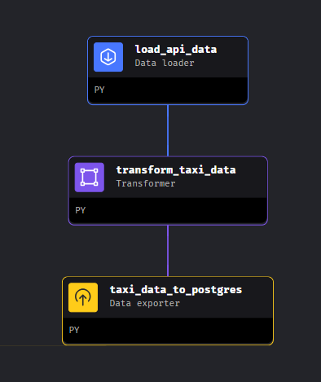
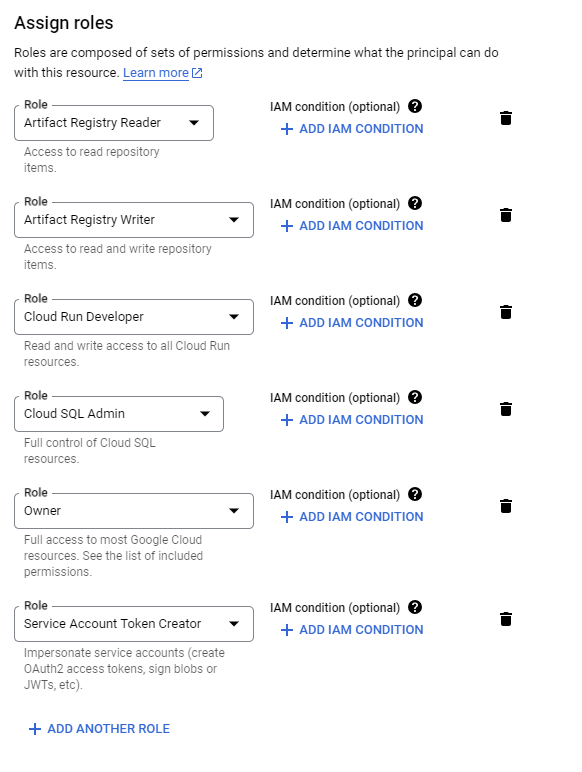

# Setup


# clone mage-zoomcamp repo

git clone https://github.com/mage-ai/mage-zoomcamp.git mage-zoomcamp

cd mage-zoomcamp
cp dev.env .env
docker compose build
docker compose up

# if you want updated
docker pull mageai/mageai:latest

# Create pipeline 1

## Api to Postgres

- Download data from api -> remove row with passenger_count==0 -> upload data in postegres ny_taxi.yellow_cab_data_v1 table




# Run in GCP

https://www.youtube.com/watch?v=00LP360iYvE&list=PL3MmuxUbc_hJed7dXYoJw8DoCuVHhGEQb&index=23

## Create Bucket

https://console.cloud.google.com/storage/browser/mage-zoomcamp-sf879;tab=objects?project=cedar-unison-413811&prefix=&forceOnObjectsSortingFiltering=false

## Service Account

create a new service account with following permissions:

save a key in json file
update the io_config.yaml with file path to **key.json

- tip:
in otrder to find the json file run 

```
ls -la
```

in the mage terminal

```
GOOGLE_SERVICE_ACC_KEY_FILEPATH: "/path/to/your/service/account/key.json"
GOOGLE_LOCATION: EU # Optional
```

## Test

run the example pipeline
upload the created .csv file in a gcp bucket


### Manual upload

run 

```
set GOOGLE_APPLICATION_CREDENTIALS='D:\\obsidian\\github\\data-engineering-course\\week_2\\mage-zoomcamp\\cedar-unison-413811-87753dffae79.json'
set GCP_GCS_BUCKET='mage-zoomcamp-sf879'

```

# Run pipeline on GCP

clone mage terraform template
https://github.com/mage-ai/mage-ai-terraform-templates
